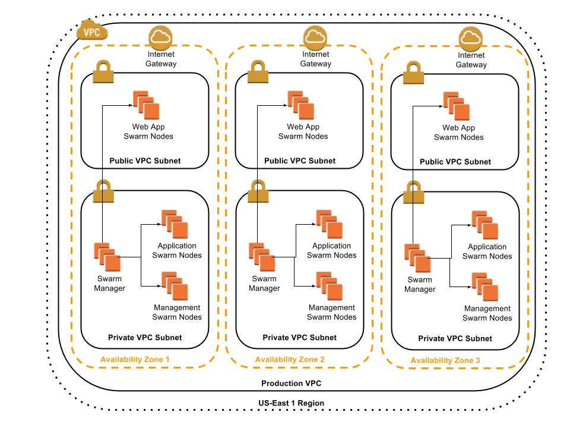

# JRA Architecture Notes

## Overview

This page is a free-form collection of notes and links as I start to build out the Joe Rice Architect architecture documentation.

## Links and stuff

**AWS infrastructure and architecture Documents**

* High-Level AWS infrastructure - [Google Doc Drawing](https://docs.google.com/drawings/d/10Z6i-1Ge9CzbDfNAYTXsVc7q3LhO6wSO_0Z1DwOQO34/edit)

##Stuff to document in Architecture##

###Infrastructure Architecture###
**High-Level AWS Infrastructure**

* 1 VPC Per Environment
* Use 3 Availability Zones for High Availability & Disaster Recovery
* Each Avail Zone has 1 public subnet and 1 private subnet
* Each Avail Zone has 1 Docker Swarm.  1 Swarm Manager and Multiple Swarm Nodes (each swarm manager and node will have 2 or more ec2 instances)
* Swarm Manager is in private subnet.  But manages swarm nodes in both public and private subnet

**Detailed AWS Infrastructure**

**Management Swarm Nodes**

**Application Swarm Nodes**

**Security**

**Logging**

**Monitoring**
   **Infrastructure
   **Containers
   **Application

**Deployment Pipeline**

**Environments**

###Application Architecture###
**Media Management**

**Content Management**

**Persistence**

## Infrastructure setup - Full List

**Security Zones**

* Public Security Zones
  - app-ui-web
  - app-ui-web-pci
  - app-ui-mobile
  - app-ui-cache
  - app-api-web
* private Security Zones
  - build
  - app-api-service
  - app-api-service-pci
  - app-persistence
  - management
  - management-persistence
  - admin
  - admin-pci

**Swarm Nodes**

* Public Swarm Nodes
  - app-ui-web
  - app-ui-web-pci
  - app-ui-mobile
  - app-api-web
* private Swarm Nodes
  - build
  - app-api-service
  - app-api-service-large
  - app-api-service-pci
  - app-api-service-pci-large
  - app-persistence
  - app-persistence-large
  - app-persistence-read
  - management
  - management-persistence
  - management-persistence-read
  - admin
  - admin-pci

## Infrastructure setup - JRA

**Security Zones**

* Public Security Zones
  - app-ui-web
  - app-api-web
* private Security Zones
  - build
  - app-api-service
  - app-persistence
  - app-persistence=read
  - management
  - management-persistence
  - management-persistence-read
  - admin
  - admin-pci

**Swarm Nodes**

* Public Swarm Nodes
  - app-ui-web
  - app-api-web
* private Swarm Nodes
  - build
  - app-api-service
  - app-api-service-large
  - app-persistence
  - app-persistence-large
  - app-persistence-read
  - management
  - management-persistence
  - management-persistence-read
  - admin
  - monitoring

**Standard Tags on Infrastructure**

* com.jra.environment
  - latest
  - stage
  - qa-static
  - qa-push
  - production
* com.jra.environment-type
  - latest
  - test-regression
  - test-uat
  - test-pat
  - test-penetration
  - test-load
  - pre-prod
  - prod
* com.jra.environment-flip
  - blue
  - green
* com.jra.application-name
* com.jra.container-name
* com.jra.failure-zone
  - us-east-1-az-1
  - us-east-1-az-2
  - us-east-1-az-3
  - us-west-1-az-1
  - us-west-1-az-2
  - us-east-1-az-3

**Ports to open for security groups**

* Overlay network between all swarm nodes in application network:
  -  Port 7946 TCP/UDP  - for container network discovery.
  -  Port 4789 TCP/UDP  - for the container overlay network.
  -  Port 50 TCP/UDP    - for the container overlay network with encryption (--opt encrypted)
  -  Port 2377 TCP      - for cluster management communications

# Standard application ports  #

**Joe Rice Architect - Sites and APIs**

| Application | Exposed Port | Domain Name             | Description |
| ----------- | ------------ | ----------------------- | ----------- |
| JArch Web UI  | 8080       | www.joericearchitect.com      | Main Web Site |
| JArch Blog UI | 8081       | blog.joericearchitect.com     | Blog |
| JArch Web API | 8082       | webapi.joericearchitect.com   | Main Web Site |

**Joe Rice Architect - Admin, Infrastructure, and Managmement**

| Application                | Exposed Port | Container Port | Domain Name                       | Description |
| -------------------------- | ------------ | -------------- | --------------------------------- | ----------- |
| Build / CI CD Tool         | 8180         |                | build.joericearchitect.com        | CI / CD pipeline / build |
| Load Generators            | 8181         |                | load.joericearchitect.com         | Load Generator Boxes for performance testing |
| Dashboard and Metrics App  | 8182         |                | dashboard.joericearchitect.com    | Dashboard and metrics site            |
| Private Docker Registry    | 8183         |                | docker.joericearchitect.com       |             |
| Portainer (UI for docker)  | 8184         |                | dockerui.joericearchitect.com     |             |
| Maven / Gradle Repo        | 8185         |                | maven.joericearchitect.com        |             |
| Splunk                     | 8186         |                | splunk.joericearchitect.com       |             |
| Kibana                     | 8187         |                | kibana.joericearchitect.com       |             |
| Traefik UI                 | 8188         |                | proxy.joericearchitect.com        |             |
| JArch Blog MySql           | 8189         |                | blogdb.joericearchitect.com       |             |
| Docker Visualizer          | 8190         |                | dockervisual.joericearchitect.com |             |
| ElasticSearch              | 8191         | 9200           | es.joericearchitect.com           |             |

# Standard Data Volumes and directories #

**Standard Directories in Data Volumes**

* /usr/local/jra/docker-data-volumes
  + jra-site
    * site
    * blog-wp
      + etcd
      + mysql
        * conf
        * data
      + wordpress
        * data
        * wp-content
  + jra-infra
    * docker-ui-portainer
      + data
    * proxy-traefik
    * build-jenkins
      + home
    * docker-registry
      + data
    * logging-elasticsearch
      + data
  + mta-app
    * site

**Standard Binding Mounts**

* Infra - Portainer
  + Data
    + Host
      - /usr/local/jra/docker-data-volumes/jra-infra/docker-ui-portainer/data
    + Container
      - /data

* Infra - Jenkins
  + Home
    + Host
      - /usr/local/jra/docker-data-volumes/jra-infra/build-jenkins/home
    + Container
      - /var/jenkins_home

* Infra - ElasticSearch
  + Home
    + Host
      - /usr/local/jra/docker-data-volumes/jra-infra/logging-elasticsearch/data
    + Container
      - /data

* Infra - Registry (NOTE:  switch to s3 so we can replicate the service.  Then, remove this mount)
  + data
    + Host
      - /usr/local/jra/docker-data-volumes/jra-infra/docker-registry/data
    + Container
      - /var/lib/registry
  + certs
    + Host
      - /usr/local/jra/docker-data-volumes/jra-infra/docker-registry/certs
    + Container
      - /certs

* App Blog - WordPress - MySql
  + Conf
    + Host
      - /usr/local/jra/docker-data-volumes/jra-site/blog-wp/mysql/conf
    + Container
      - /etc/mysql/conf.d
  + Data
    + Host
      - /usr/local/jra/docker-data-volumes/jra-site/blog-wp/mysql/data
    + Container
      - /var/lib/mysql
  + User
    + jenkins (uid 1000)

* App Blog - WordPress - Wordpress-UI
  + Conf
    + Host
      - /usr/local/jra/docker-data-volumes/jra-site/blog-wp/wordpress/data
    + Container
      - /data
  + Wp-content
    + Host
      - /usr/local/jra/docker-data-volumes/jra-site/blog-wp/wordpress/wp-content
    + Container
      - /var/www/html/wp-content
  + User
    + jenkins (uid 1000)

**Directories to create for each node type**

* app-persistence
  - /usr/local/jra/docker-data-volumes/jra-site/blog-wp/mysql/conf
  - /usr/local/jra/docker-data-volumes/jra-site/blog-wp/mysql/data

```
sudo mkdir -p /usr/local/jra/docker-data-volumes/jra-site/blog-wp/mysql/conf
sudo mkdir -p /usr/local/jra/docker-data-volumes/jra-site/blog-wp/mysql/data

sudo chmod -R 777 /usr/local/jra/docker-data-volumes
```

* infra-logging
  /usr/local/jra/docker-data-volumes/jra-infra/logging-elasticsearch/data

```
sudo mkdir -p /usr/local/jra/docker-data-volumes/jra-infra/logging-elasticsearch/data

sudo chmod -R 777 /usr/local/jra/docker-data-volumes
```

* app-UI
  - /usr/local/jra/docker-data-volumes/jra-site/blog-wp/wordpress/data
  - /usr/local/jra/docker-data-volumes/jra-site/blog-wp/wordpress/wp-content

```
sudo mkdir -p /usr/local/jra/docker-data-volumes/jra-site/blog-wp/wordpress/data
sudo mkdir -p /usr/local/jra/docker-data-volumes/jra-site/blog-wp/wordpress/wp-content

sudo chmod -R 777 /usr/local/jra/docker-data-volumes
```

* swarm manager

```
sudo mkdir -p /usr/local/jra/docker-data-volumes/jra-infra/docker-ui-portainer/data

sudo chmod -R 777 /usr/local/jra/docker-data-volumes
```

* management (for now all management stuff is on "build" nodes)

```
sudo mkdir -p /usr/local/jra/docker-data-volumes/jra-infra/docker-registry/data
sudo mkdir -p /usr/local/jra/docker-data-volumes/jra-infra/docker-registry/certs

sudo chmod -R 777 /usr/local/jra/docker-data-volumes
```

* build

```
sudo mkdir -p /usr/local/jra/docker-data-volumes/jra-infra/build-jenkins/home

sudo chmod -R 777 /usr/local/jra/docker-data-volumes
```

**Standard Data Volumes**

